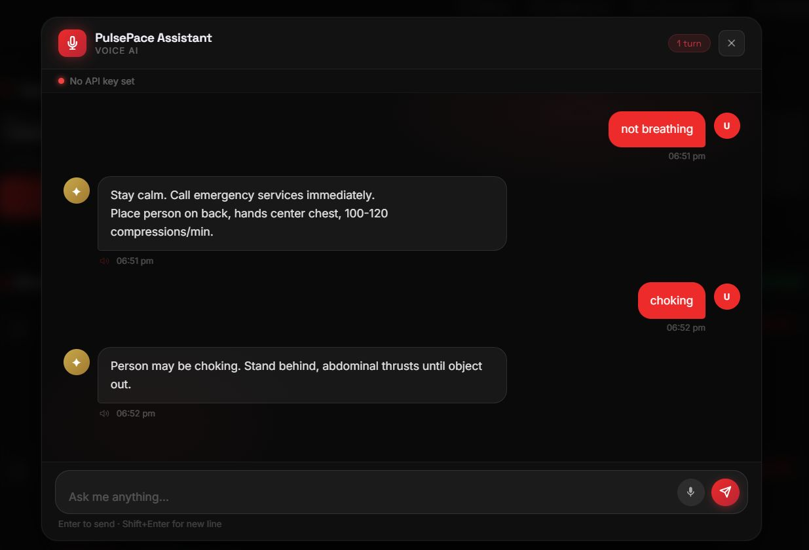
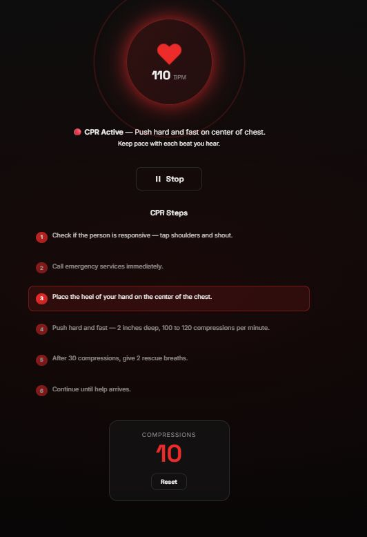

<div align="center">

# ❤️ PulsePace — AI-Based Voice Emergency Assistance System

**A voice-activated emergency assistant that guides bystanders through CPR in real time, while alerting nearby hospitals and ambulances with live location data.**


[](https://github.com/Khyathi-Priya/PulsePace-AI-Emergency-Assistance-System/stargazers)
[](https://github.com/Khyathi-Priya/PulsePace-AI-Emergency-Assistance-System/network)
[](LICENSE)

</div>

---

## 📌 Overview

**PulsePace** is a voice-activated emergency assistance system built to help bystanders act quickly and confidently during critical medical situations. When someone collapses or stops breathing, panic often takes over and life-saving steps get forgotten. PulsePace bridges that gap by combining voice technology, geolocation, and rapid communication with hospitals and ambulances — guiding the user through CPR in real time while simultaneously alerting nearby emergency responders.

By turning a stressful, uncertain moment into a guided, step-by-step process, PulsePace aims to reduce response time and increase the chances of saving a life — empowering anyone, regardless of medical training, to take immediate and effective action.

---

## ❗ Problem Statement

During sudden medical emergencies such as cardiac arrest:

- 😰 Bystanders panic and forget proper CPR steps
- 🚫 Ambulances are not alerted immediately
- 🗣️ Lack of real-time guidance delays life-saving action
- ⏱️ This delay can significantly reduce the chances of survival

---

## 💡 Solution

PulsePace acts as a voice-based emergency assistant that:

1. Listens to the user through a voice input button
2. Detects emergency phrases like *"He is not breathing"*
3. Provides step-by-step CPR instructions in voice format
4. Sends GPS location and user details to nearby hospitals and ambulance drivers
5. Displays ambulance driver details on the screen for quick response

---

## 📸 Screenshots





---

## 🧠 System Architecture

```
User Presses Voice Assistant Button (🎙️)
        ↓
Voice Input Recorded
        ↓
Speech-to-Text Conversion
  (Speech Recognition)
        ↓
Backend Processes Emergency Request
  (FastAPI)
        ↓
CPR Instructions Generated
        ↓
Text-to-Speech Audio Output
        ↓
User GPS Location Captured
  (Geolocation API)
        ↓
Alert Sent to Nearby Hospitals & Ambulance Drivers
        ↓
Ambulance Details Displayed on Interface
```

---

## 🚀 Key Features

| Feature | Description |
|---|---|
| 🎙 Voice Activated Emergency Assistant | Hands-free activation during a crisis |
| ❤️ Step-by-Step CPR Voice Guidance | Reduces panic with clear spoken instructions |
| 📍 Real-Time GPS Location Sharing | Pinpoints the user's exact location |
| 🚑 Automatic Alert to Nearby Hospitals & Ambulances | Speeds up emergency response |
| 📢 Audio Output Instructions | Keeps the bystander hands-free and focused |

---

## 🧰 Tech Stack

| Layer | Technology | Purpose |
|---|---|---|
| Frontend | HTML, CSS, JavaScript | User interface & voice button interaction |
| Backend | Python, FastAPI | Emergency request processing & coordination |
| Speech | Speech Recognition | Converts voice input to text |
| Audio | Text-to-Speech | Converts CPR instructions into spoken guidance |
| Location | Geolocation API | Captures and shares real-time GPS coordinates |

---

## ⚙️ Installation & Setup

### 1. Clone the Repository
```bash
git clone https://github.com/Khyathi-Priya/PulsePace-AI-Emergency-Assistance-System.git
cd PulsePace-AI-Emergency-Assistance-System
```

### 2. Install Backend Dependencies
```bash
pip install -r requirements.txt
```

### 3. Run the Backend Server
```bash
uvicorn main:app --reload
```

### 4. Launch the Frontend
Open `index.html` in your browser, or serve it via a local development server.

---

## 📁 Project Structure

```
PulsePace-AI-Emergency-Assistance-System/
│
├── index.html                # Frontend UI
├── style.css                 # Styling
├── script.js                 # Voice input & geolocation handling
├── main.py                   # FastAPI backend
├── requirements.txt          # Python dependencies
└── images/                   # Screenshots
```

---

## 🎯 Applications

- 🚨 Bystander CPR Assistance
- 🏥 Emergency Hospital & Ambulance Coordination
- 📍 Real-Time Location-Based Emergency Response
- 🩺 Public Health & Disaster Response Tools

---

## 🚀 Future Enhancements

- [ ] AI-based automatic emergency detection (recognize distress without manual activation)
- [ ] Multilingual voice support for wider accessibility
- [ ] Integration with smartwatches and IoT devices for faster alerts
- [ ] Real-time hospital bed availability tracking
- [ ] Mobile application for Android and iOS
- [ ] Integration with government emergency services (108 / 911)

---

## 📝 Conclusion

PulsePace is designed to assist people during critical medical emergencies by providing instant voice-guided CPR instructions and real-time emergency coordination. By combining voice technology, geolocation, and rapid communication with hospitals and ambulances, the system aims to reduce response time and increase the chances of saving lives.

This project demonstrates how technology can be used to create accessible, life-saving solutions that empower bystanders to take immediate action during emergencies.

---

## 👩‍💻 Team

Developed as a **Hackathon Project — PulsePace**

[](https://github.com/Khyathi-Priya)
[](https://www.linkedin.com/in/khyathi-priya-kamireddi-83144a2b8/)

---

## 📜 License

This project is intended for **educational and research purposes**.
